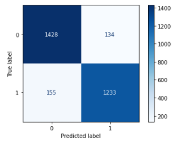
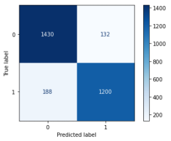
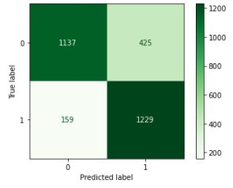
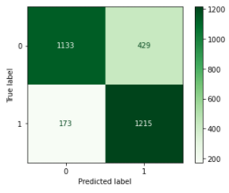
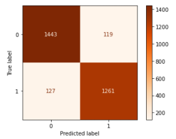
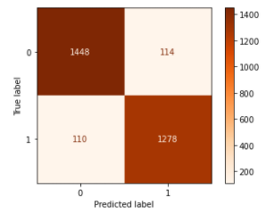
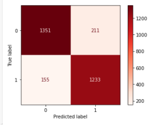

# Woah! Reddit Subreddit Identification Using Scrapped Data from Reddit
*Data Classification Modeling and Visualization*
 ##### Arink Bertrand

## Table of Contents
- [Define the Problem](#obj)
- [Gather & Clean the Data](#clean)
    - [Data Dictionary](#data)
- [Exploratory Data Analysis](#eda)
- [Model the Data](#model)
- [Answer the Problem](#answer)
- [Dependencies](#depend)
- [Enough Talk! Confuse Me with That Matrix!](#matrix)

<h3>Define the Problem</h3>

Sometimes you just want to hear some stories from reddit, to reflect on how much better your life is compared to some of the horror stories while encountering your mother-in-law or someone you know. While doing dishes or driving, maybe you'd want to nod and say "Ya, you are the asshole!". Since we can't read and drive we'll ask our phone to read it to us and in return we only catch a few words here and there, but can we tell if the story is about an Asshole or someone's mother-in-law based on a few words? 

As you may have gathered, posts in r/AmItheAsshole and r/JustNOMIL will have a lot of crossover. Both subreddits will have a form of complaint against another person, be it a stranger, significant other, in-laws, parents etc. I collected a large sample of Reddit posts from both the <a href='https://www.reddit.com/r/AmItheAsshole/'>r/AmITheAsshole</a> and - <a href= 'https://www.reddit.com/r/JUSTNOMIL/'>r/JustNOMIL</a> subreddits, conducted EDA and natural language processing on them, and fit multiple classification models on them to determine whether the model can re-classify the posts to their subreddits.

<h3>Gather & Clean the Data</h3>

My data acquistion journey begin with a function to pull posts from reddit using the request library from PushShift API. I at that time started with the newest post and worked my way backwards using the Before: perameter set to the timestamp of the last post pulled from the last request. The API only allows 200 posts per minute to be pulled, so I set a time.sleep to 30seconds and using a while loop I iterated through the process until I had 9,000 of r/AmITheAsshole and 7,000 of r/JustNoMIL. Despite setting a filter to not include moderator removed or user deleted alot of these posts still made it through the filter on r/AmIThe Asshole. Since the post paragraphs were so robust (some lengths going as high as 25 000), I opted not to pull any comments.

After all cleaning was completed on both datasets (removing mod/user removed posts, dropping any duplicates that made it through, removing any AutoModerator posts, and removing any odd characters such as /n and &amp...) I concatenated the two datasets. I now had a Corpora of 11,799 rows and 3 columns. My subreddits were split: 52% JustNoMIL and 47% AmITheAsshole.
<h4> Data Dictionary</h4>

|Column|Description|
|---|---|
|author|Username of the poster|
|title|The title of the post|
|selftext| Post paragraph|
|subreddit|Name of subreddit later changed to 0 (JustNoMIL) and 1 (AmITheAsshole)|

<h3>Exploratory Data Analysis</h3>

I made some additional columns for the purpose of EDA, checking how many words each subreddit used as a whole, how many of them were in all caps, the length of the posts and how many unique users each user had with a count of how many post in both subreddits.

In EDA the words were put through CountVectorizer with the base 'english' stopwords dictionary to identify any other words that need to be added to the stopwords for model prediction.

<h3>Model the Data</h3>

I began the process by identifying my X and y variables, where the target (y) is sub_reddit. I ran the models through a GridSearch Pipeline with parameters the estimator and/or the transformer. Different variations of stopwords were tried ('english', top 15, identifiable words such as: aita, waita, justnomil, mil, asshole etc., a combination of all/either) until I settled on masking the identifiable words with the word '*ref*' and adding them to the stopwords dictionary. This allowed my model to perform better than removing the words completely but still made the prediction challenging for the model compared to leaving the words for its prediction use.

<h4>Model_Naive_Bayes Notebook</h4>

In this notebook I did four different variations of Naive Bayes to compare the outcomes:
- MultinomialNB with CountVectorizer
- MultinomialNB with TFIDF
- BernoulliNB with CountVectorizer
- BernoulliNB with TFIDF

Of the Naive Bayes models, the *MultinomialNB with CountVectorizer* model performed best, it had the least amount of misclassified words at 90.20% precision. Even though the *BernoulliNB with CountVectorizer* model had the closest train, test scores and therefore least overfit of all, it's precision and specifity were in the lower 70% range. This model had 584 misclassified words compared to 289 from our best model so far.

<h4>Model_Logistic_Regression Notebook</h4>

In this notebook I used LogisticRegression with both CountVectorizer and TFIDFVectorizer

Of the Naive Bayes models, the *MultinomialNB with CountVectorizer* model performed best, it had the least amount of misclassified words at 90.20% precision.

The reason I picked these 2 models was because from previous labs LogisticRegression seemed to do the best with Classification Prediction. I don't have much experience with AdaBoost and I understand the hyperparameters 

<h3>Answer the problem</h3>

The Multinomial Naive Bayes model with CountVectorizer was the best model. It handled unseen data well and  had a fairly balanced tradeoff between bias and variance so I would use it to re-classify reddit posts. 

I believe that my model as it is will be able to predict which subreddit the words belong to. To make the model more robust, I would pull in some comments and see if there are ny identifiers within the comments that would help the model predict better.

<h3>Dependencies</h3>

- Python 3 (or newer)
- Numpy
- Pandas
- Matplotlib
- Seaborn
- Plotly
- PIL
- Wordcloud (for aesthetic only)
- Sklearn  

<h3>Enough Talk! Confuse Me with That Matrix!</h3> 
Here are all the confusion Matrices for the Models for comaprison:
 
How to read confusion matrix:

|||
|--|--|
|Was JustNOMIL|Was NOT JustNoMIL|
|Was NOT AmITheAsshole|Was AmITheAsshole|
In the first example below,
- 1428 words were preddicted as JustNoMIL that were in fact words from JustNoMil
- 134 words were preddicted as JustNoMIL that were NOT words from JustNoMil
- 155 words were preddicted as AmITheAsshole that were NOT words from AmITheAsshole
- 1233 words were preddicted as AmITheAsshole that were in fact words from AmITheAsshole

 

|MultinomialNB with CountVectorizer|MultinomialNB with TFIDF|
|---|---|
|||
|**BernoulliNB with CountVectorizer**|**BernoulliNB with TFIDF**|
|||
|**LogisticRegression with CountVectorizer**|**LogisticRegression with TFIDF**|
|||
|**AdaBoost Classifier with CountVectorizer**|**AdaBoost Classifier with TFIDF**|
|||

##### Sources
- <a href= 'https://www.reddit.com/r/AmItheAsshole/'>r/AmITheAsshole</a>
- <a href= 'https://www.reddit.com/r/JUSTNOMIL/'>r/JustNOMIL</a>
- Snoo is <a href='https://www.reddit.com/'>Reddit's</a> alien mascot.
- <a href= 'https://medium.com/plotly/nlp-visualisations-for-clear-immediate-insights-into-text-data-and-outputs-9ebfab168d5b'>NLP visualizations for clear, immediate insights into text data and outputs</a>
